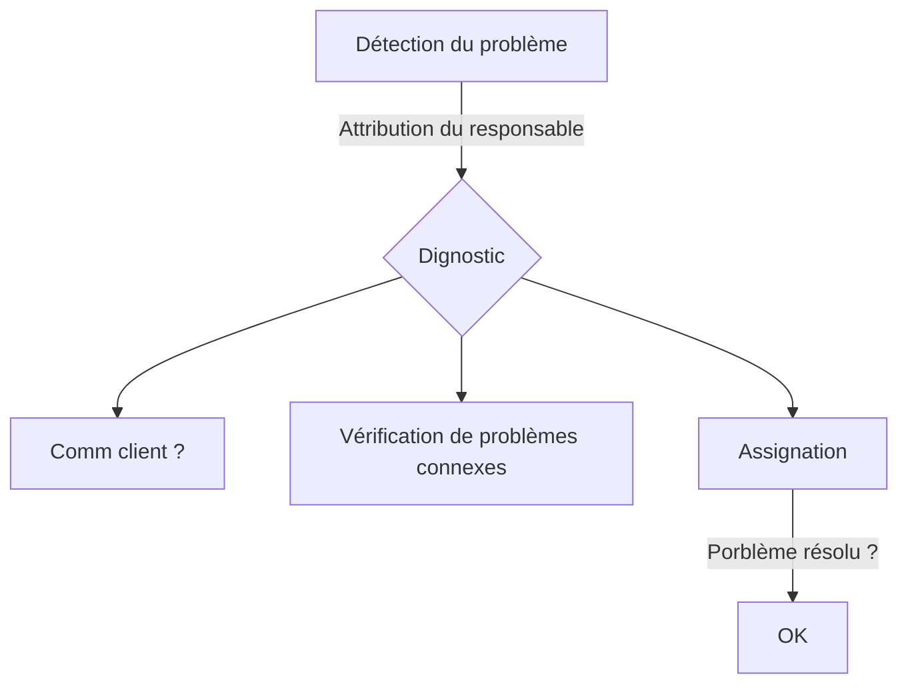

Territories
================


This package allows to represent and operate on territories.

The only assumptions of the model are :
- The entire world can be partitioned with atomic entities
- There are several partition of the world in sets of atomic entities.
- A **territory** is a collection of those atomic entities


A Territory object can be any combination of entities, such as municipalities, countries, county, länders, states, etc, as long as it belongs to the DAG of entities. The package guarantee that the representation of a territory will always be efficient. For instance, if I create a `Territory` object with all regions from a country, it will simplify it to only the country object.

## Usage

At startup, you need to initialize a tree of all known entities. Ths can be done in two ways :
- from a local file. By default, the tree is build from a file in the API_CACHE_DIR
- from a database : there are utility functions in territories.database to create a tree from the current database. You need to specify some environements variables to use such functions.


```python
from territories import Territory, MissingTreeCache
from territories.database import create_connection, stream_tu_table

try:
    Territory.load_tree()
except MissingTreeCache:
    with create_connection("crawling") as cnx:
        Territory.build_tree(data_stream=stream_tu_table(cnx))
```

The `build_tree()` function will read the TU table, and create a territory tree out of it, with all its 35099 elements

> [!NOTE]
> It only takes a few seconds to load, but it takes around 30s (and a CPU spike) to construct the perfect hash function that maps (es_code) -> (node in the tree).


## Exemple of a potential usage of such a package

```python
# es code are received from the UI, for instance
topic_territory = Territory.from_es_codes("COM:234", "COM:943", "DEP:23")


# lowest common ancestor of the territorial units
lca = topic_territory.lowest_common_ancestor()

# all ancestors of the territorial units
all_ancestors = topic_territory.ancestors()

# union of the territories
bu_teritory = Territory.union(*(topic.territory for topic in bu))

for article in articles:
    for territory in article.territories:
        if territory in bu_territory:
            article.send() # send article in brief
        if territory in topic_territory:
            # do something else

# filter territories in an ElasticSearch query
query = {"ids" : {
    "values" : ids
    }}

query['bool']['should'].extend(topic_territory.to_es_query())

documents = HArticle.search(using=target.es, index=target.index)\
        .query(query)\
        .execute()
```


## Questions left to answer


> [!WARNING]
> If a child has several parents (Grand Lyon or département du Rhône, île-de-france or IDF mobilité), how should we chose ?


## Package structure

I used [this](https://py-pkgs.org/01-introduction) website as the main ressource for the structure of the package. Also [this](https://docs.python-guide.org/writing/structure/) one is useful.


## Tests

The tests checks the behavior of **Territory** objects. You can change whatever you want internaly as long as the tests passes.


To run the tests :
```sh
$ pip install -r requirements-dev.txt
$ pip install .
$ pytest

>>> tests/test_interface.py .....   [ 45%]
>>> tests/test_operators ......     [100%]
>>> 11 passed in 0.14s 
```


## Deployment

CI automatically deploy the package when there are push on the main branch. Do not deploy yourself.


## Manuel de gestion de crise




https://excalidraw.com/#json=gDNoiB0Zi1H-EK9DNxjy0,2BE3eSWuH675063oDQeAvw


## Compte rendu

J'ai l'honneur de vous rendre compte...

Le post-mortem s'est déroulé de la façon suivante
Un retour sur la façon dont le problème a été découvert (plus ou moins par hasard), et a été remonté à l'équipe. Le manque de réactivité sur le problème a été particulièrement mis en cause.

La cause exacte vient d'une manipulation des DAGs le 20 octobre, et dont les conséquences n'ont pas été détectée le lendemain, date à partir de laquelle l'alerte aurait du être lancée.

Il en est ressorti deux axes majeurs :
- le besoin d'avoir un dashboard de métriques générales consulté par l'équipe à chaque stand up. Il ne faut pas un système d'alertes qui peuvent se perdre dans un flot d'email, mais instaurer dans la culture de l'équipe de regarder les métriques à chaque stand up pour identifier les tendances générales et toute anomalie.
- le besoin d'avoir un processus d'urgence clair. Par exemple, prendre la décision de ce qui constitue une emergency  prod, et l'utilisation du canal éponyme.